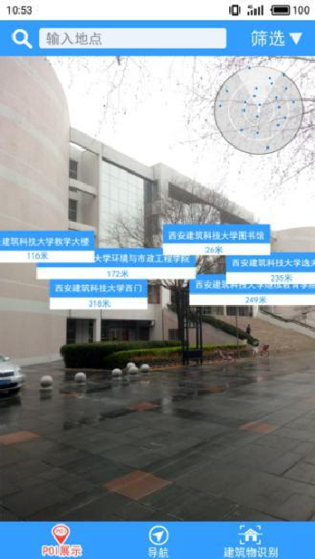
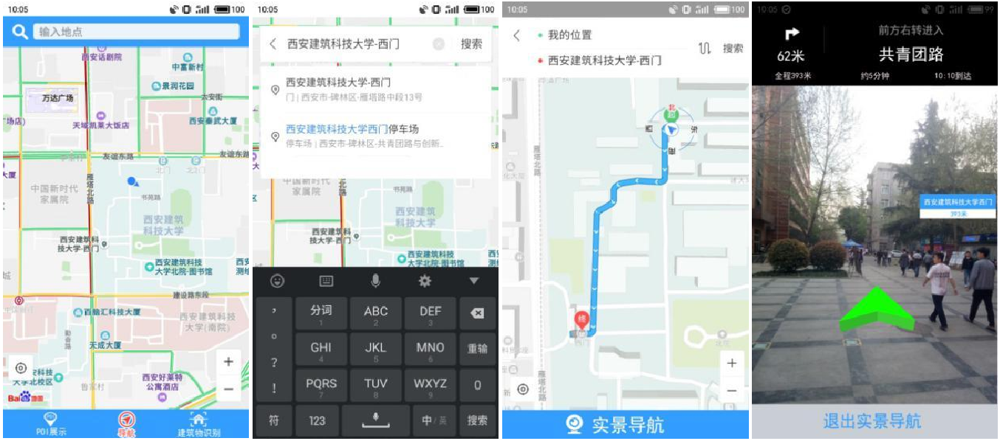

# 基本概念

POI，Point of Interest，可以称为“兴趣点”，是地理信息系统中的一个基本概念。一个POI可以是一栋房子、一个商铺、一个邮筒、一个公交站等。

# 可实现的功能

我们计划实现这些功能之中的一个或多个：

- 在实景之上显示多个悬浮标签，提供周围的POI信息
- 实时AR导航
- AR识别建筑物
- 查看全景地图

# 技术难题

AR导航是我们从未接触过的领域，因此在不少方面我们都面临着新的挑战：

- 如何解析百度地图提供的导航路线，结合实景实现实时的AR导航？

- 如何使用OpenGL在应用界面上绘制灵活变化的3D箭头？
- 是否需要自定义POI标签的显示和搜索？
- ……

等等。

# 进展

目前我们还处于研究百度地图API的阶段。

- 百度地图的API比较复杂，从给例中找出所需功能的接口、并整合应用到新的代码中，并不容易；
- 理想是丰满的，现实是骨感的，有些API的实际使用体验并不像设想中的那样，需要进一步调整和确认。比如，自动定位存在问题；再比如，附近可AR识别的建筑物似乎比较少，这可能使我们的应用效果大打折扣。

# Demo

参考论文中，主要的运行效果如下：

- 可以实时显示悬浮位置标签

  

- 可以进行实景导航

  

